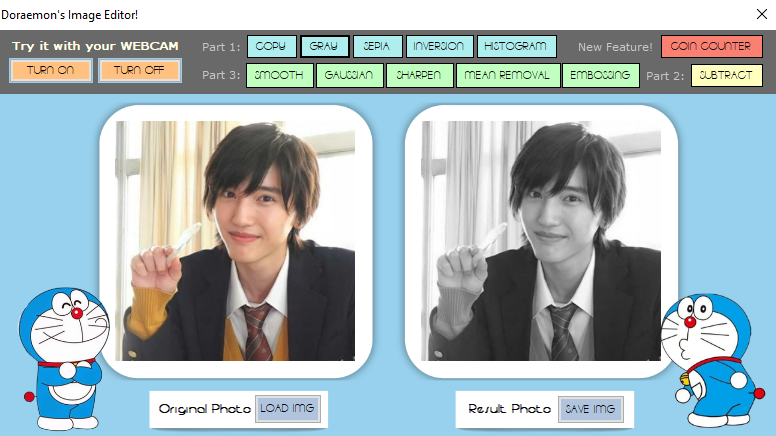

# Digital Image Processing Activity
CS345 - Intelligent Systems

## Part 1: Copy and Filters

## Part 2: Subtraction Effect

## Part 3: Smoothing and Embossing Effects

## Part 4: Coins Counter

---

## Use with Webcam

You can also apply the effects and filters **live** to your webcam feed in real-time. Here's how:

1. **Enable your webcam** 
2. **Select a filter / an effect** 
3. **See the changes** 

